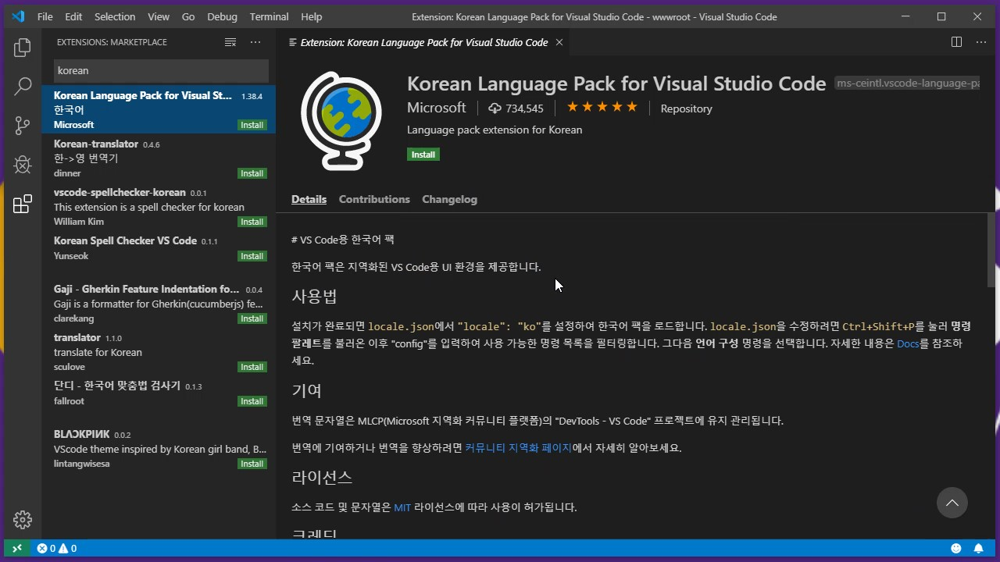
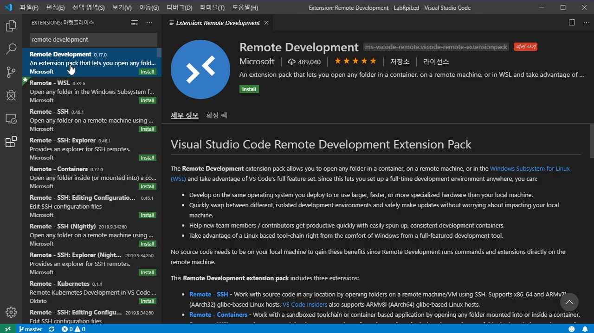
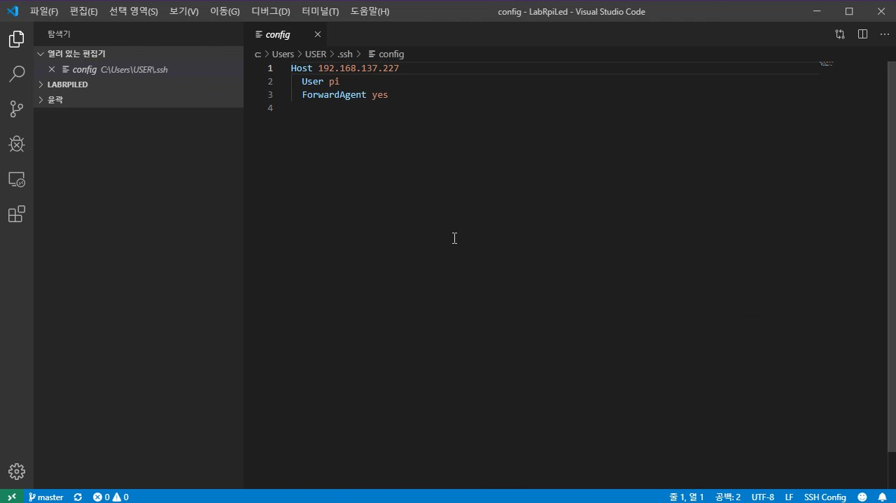
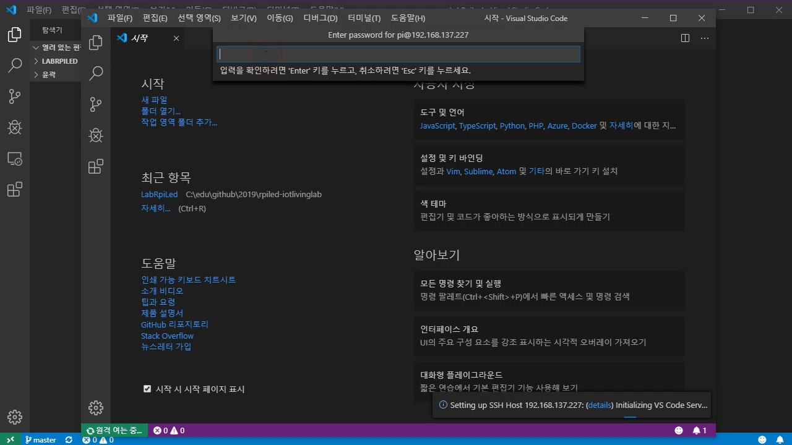
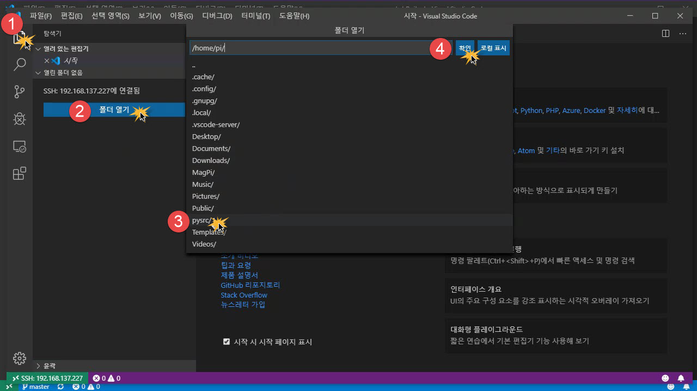
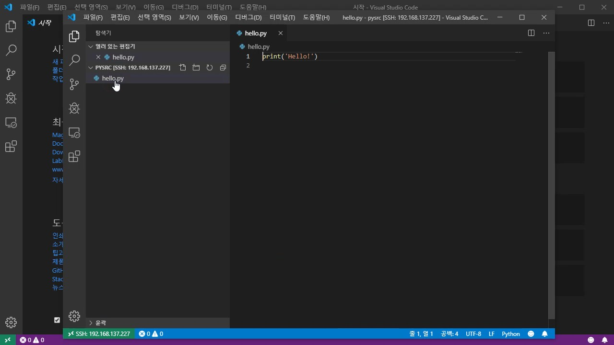
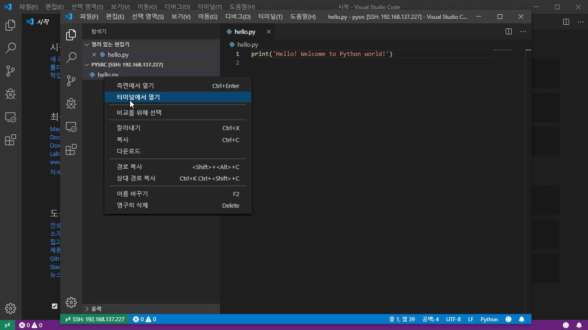
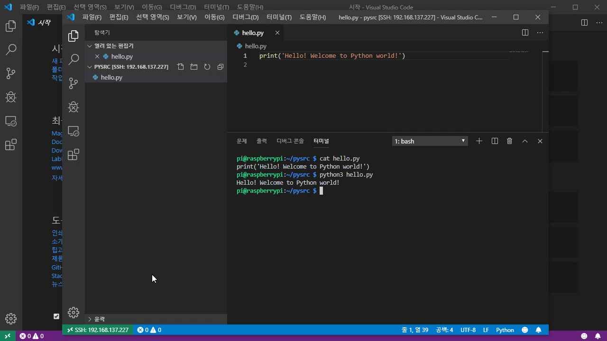

# Visual Studio Code 개발툴 한글 적용

1. 좌측 'Extensions' 아이콘 클릭한다.
2. 검색 박스에 'korean' 입력한다.
3. 목록에서 'Korean Language Pack for Visual Studio Code' 선택한다.
   
4. 'Install' 버튼 클릭한다.
5. 하단의 'Restart Now' 버튼 클릭한다.

   [Youtube - Visual Studio Code 개발툴 한글화](https://youtu.be/kx7kpDC5llg)

# 테스트 디렉토리 및 샘플 소스 생성

1. TeraTerm으로 라즈베리파이에 접속한 뒤 다음 명령을 입력한다. (한 줄 끝에는 &lt;Enter&gt; 키를 누른다.)
   <pre><code>mkdir pysrc
   cd pysrc
   echo -e "print('Hello\041')" &gt; hello.py</code>
   </pre>
2. 'cat hello.py&lt;Enter&gt;'로 입력 내용이 다음과 같은지 확인한다.
   <pre><code>print('Hello!')</code></pre>
3. 'python3 hello.py&lt;Enter&gt;'의 결과를 확인한다.
   <pre><code>Hello!</code></pre>

# Visual Studio Code 원격 개발툴 설치

1. 좌측 'Extensions' 아이콘 클릭한다.
2. 검색 박스에 'Remote Development' 입력, 목록 선택후 'Install' 버튼 클릭한다.
   

# Visual Studio Code 원격 개발 환경 설정

1. &lt;F1&gt; 키를 누른다.
2. 'remotessh' 입력해서 나온 목록에서 'Remote-SSH:Connect to Host...'를 선택한다.
3. 박스 하단의 'Add New SSH Hosts...'를 선택한다.
4. 'ssh pi@&lt;원격접속할 곳의 IP 주소&gt; -A'를 입력후 &lt;Enter&gt; 키를 누른다.
   * ex) ssh pi@192.168.137.227 -A
5. 'C:\\Users\\&lt;User Account&gt;\\.ssh\\config'를 선택한다.
6. 하단에 'Host added!' 팝업을 확인후 'Open Config' 버튼을 클릭하여 다음과 같이 정의되어 있음을 확인한다.
   <pre><code>Host 192.168.137.227
       User pi
       ForwardAgent yes</code>
   </pre>
7. 'config' 탭의 'x'를 눌러서 편집창을 닫는다.
   

# Visual Studio Code 원격 접속

1. &lt;F1&gt; 키를 누른다.
2. 목록에서 'Remote-SSH:Connect to Host...'를 선택한다.
3. 박스 하단에서 앞서 정의한 IP 주소를 선택한다. (ex: 192.168.137.227)
4. 'Enter password for pi@&lt;IP 조소&gt;' 박스에 'pi'의 암호를 입력하고 &lt;Enter&gt; 키를 누른다.
   
5. 좌측 '탐색기' 아이콘 선택 → '폴더 열기' 버튼 클릭 → 'pysrc/' 선택 → '확인' 버튼을 클릭한다.
   
6. 다시 나타난 'Enter password for pi@&lt;IP 조소&gt;' 박스에 'pi'의 암호를 입력하고 &lt;Enter&gt; 키를 누른다.
7. 좌측 탐색기 창의 'hello.py'를 클릭해서 파일을 연다.
   

# Visaul Studio Code 소스 편집 및 실행

1. 원격의 'hello.py' 파일을 연다.
2. 파일 내용을 수정한다.
   * 수정전
   <pre><code>print('Hello!')</code></pre>
   * 수정후
   <pre><code>print('Hello! Welcome to Python world!')</code></pre>
3. '파일' > '저장' 또는 &lt;CTRL&gt;+'S' 키를 눌러서 변경된 소스를 저장한다.
4. 탐색기 창의 'hello.py'를 우마우스 클릭 → '터미널 열기'를 선택한다.
   
5. '터미널' 창에서 다음 명령들을 실행하여 결과를 확인한다.
   <pre><code>cat hello.py
   python3 hello.py</code>
   </pre>
   

> [Youtube - Visual Studio Code 원격 개발](https://youtu.be/UN92GX4sb6U)
